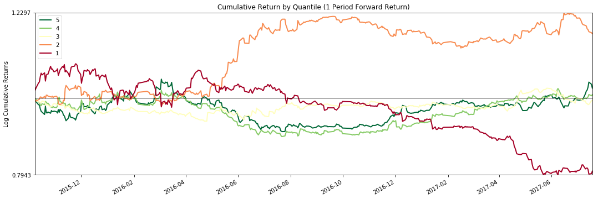
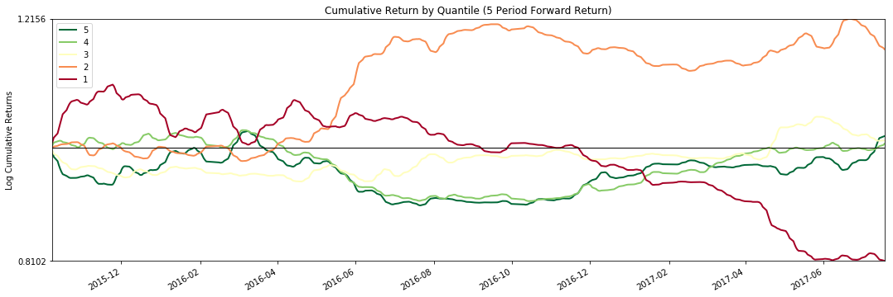
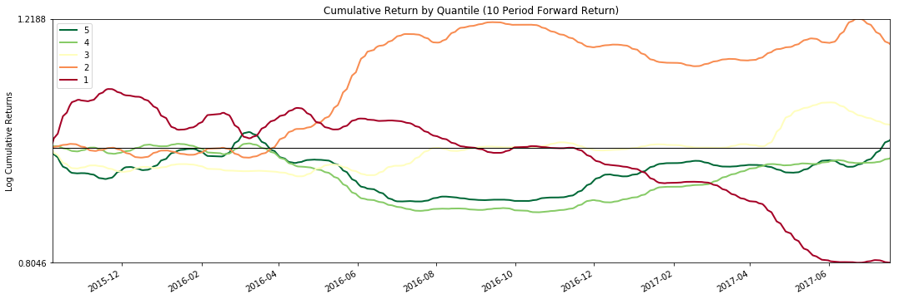
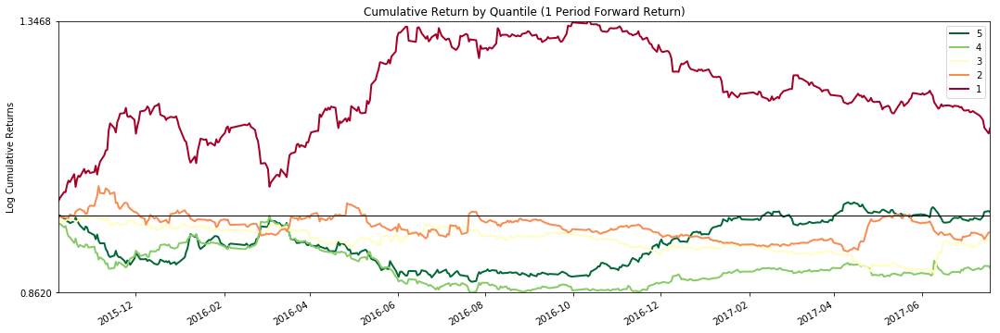
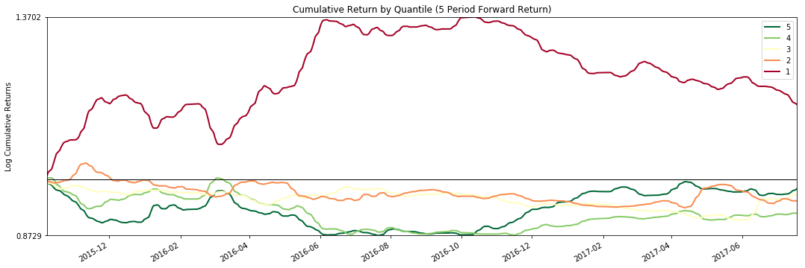
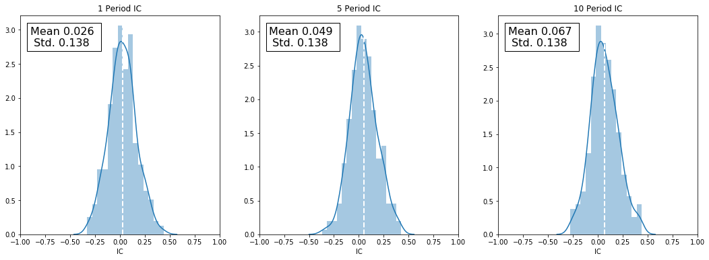
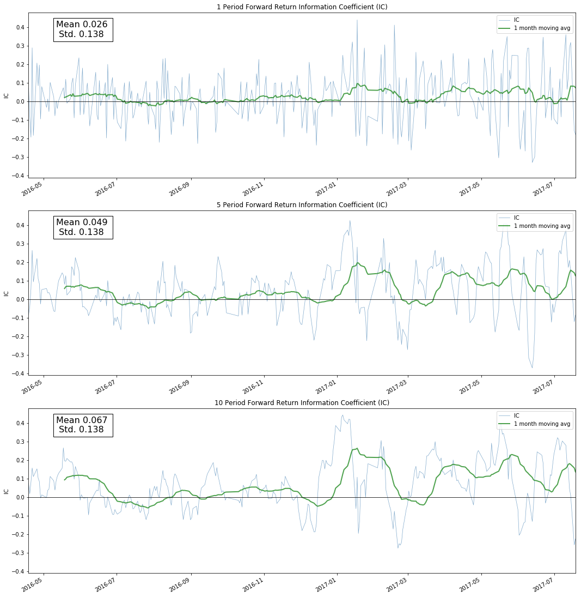
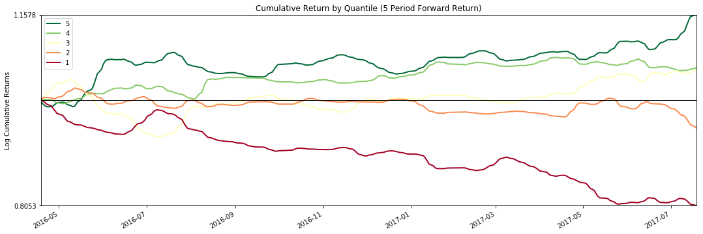
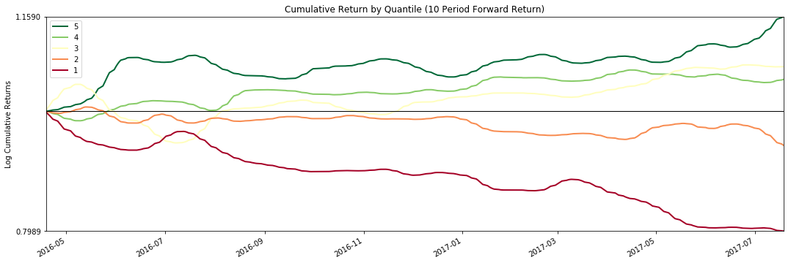

# 如何进行多因子滚动加权组合？

## 步骤

Step_1： 股票池与数据读取

Step_2： 逐个编写待组合因子算法，计算因子IC

Step_3： 以最大化IC_IR为目标滚动估算权重矩阵

Step_4： 对因子进行滚动加权,计算组合因子,进行绩效评价

Step_5： 可视化与保存选股结果

## Step_1： 股票池与数据读取
* 选取沪深300的股票代号，需要元组类型
* 获取因子的Panel数据与价格的DataFrame数据


```python
from datetime import datetime
from fxdayu_data import DataAPI

# 设置起止时间和持仓周期
start = datetime(2015, 10, 1)
end = datetime(2017, 8, 1, 15)
periods = (1, 5, 10)

codes = DataAPI.info.codes('hs300') #获取沪深300成分股
PN = DataAPI.factor(codes, ('PE', 'PS'), start=start, end=end)
prices = DataAPI.candle(codes,'D', 'close', start=start, end=end, adjust='after').minor_xs('close')
prices.head()
```


<div>
<style>
    .dataframe thead tr:only-child th {
        text-align: right;
    }

    .dataframe thead th {
        text-align: left;
    }

    .dataframe tbody tr th {
        vertical-align: top;
    }
</style>
<table border="1" class="dataframe">
  <thead>
    <tr style="text-align: right;">
      <th></th>
      <th>000001.XSHE</th>
      <th>000002.XSHE</th>
      <th>000008.XSHE</th>
      <th>000009.XSHE</th>
      <th>000027.XSHE</th>
      <th>000039.XSHE</th>
      <th>000060.XSHE</th>
      <th>000061.XSHE</th>
      <th>000063.XSHE</th>
      <th>000069.XSHE</th>
      <th>...</th>
      <th>601933.XSHG</th>
      <th>601939.XSHG</th>
      <th>601958.XSHG</th>
      <th>601985.XSHG</th>
      <th>601988.XSHG</th>
      <th>601989.XSHG</th>
      <th>601998.XSHG</th>
      <th>603000.XSHG</th>
      <th>603885.XSHG</th>
      <th>603993.XSHG</th>
    </tr>
    <tr>
      <th>datetime</th>
      <th></th>
      <th></th>
      <th></th>
      <th></th>
      <th></th>
      <th></th>
      <th></th>
      <th></th>
      <th></th>
      <th></th>
      <th></th>
      <th></th>
      <th></th>
      <th></th>
      <th></th>
      <th></th>
      <th></th>
      <th></th>
      <th></th>
      <th></th>
      <th></th>
    </tr>
  </thead>
  <tbody>
    <tr>
      <th>2015-10-08 15:00:00</th>
      <td>870.044394</td>
      <td>1255.341732</td>
      <td>226.967005</td>
      <td>60.215891</td>
      <td>119.258919</td>
      <td>409.201583</td>
      <td>229.699392</td>
      <td>313.747964</td>
      <td>265.838913</td>
      <td>279.314059</td>
      <td>...</td>
      <td>21.250517</td>
      <td>7.021696</td>
      <td>9.313700</td>
      <td>9.299</td>
      <td>5.111703</td>
      <td>17.323864</td>
      <td>7.116949</td>
      <td>70.446727</td>
      <td>17.759</td>
      <td>3.772869</td>
    </tr>
    <tr>
      <th>2015-10-09 15:00:00</th>
      <td>886.329454</td>
      <td>1270.651998</td>
      <td>228.552708</td>
      <td>61.082518</td>
      <td>119.629535</td>
      <td>419.924749</td>
      <td>252.692890</td>
      <td>312.697708</td>
      <td>271.587866</td>
      <td>280.832705</td>
      <td>...</td>
      <td>21.776415</td>
      <td>7.074601</td>
      <td>9.801121</td>
      <td>9.406</td>
      <td>5.140027</td>
      <td>17.508518</td>
      <td>7.152521</td>
      <td>71.994603</td>
      <td>17.700</td>
      <td>3.930249</td>
    </tr>
    <tr>
      <th>2015-10-12 15:00:00</th>
      <td>913.169645</td>
      <td>1294.668101</td>
      <td>247.554720</td>
      <td>64.490272</td>
      <td>125.784407</td>
      <td>437.044597</td>
      <td>278.042279</td>
      <td>342.833631</td>
      <td>282.918650</td>
      <td>295.318253</td>
      <td>...</td>
      <td>21.835316</td>
      <td>7.234787</td>
      <td>10.354410</td>
      <td>10.311</td>
      <td>5.233942</td>
      <td>19.254333</td>
      <td>7.354519</td>
      <td>75.984774</td>
      <td>18.401</td>
      <td>4.203537</td>
    </tr>
    <tr>
      <th>2015-10-13 15:00:00</th>
      <td>905.027115</td>
      <td>1293.767497</td>
      <td>272.370977</td>
      <td>64.762011</td>
      <td>125.029939</td>
      <td>432.020294</td>
      <td>284.120479</td>
      <td>344.333997</td>
      <td>282.434000</td>
      <td>293.020814</td>
      <td>...</td>
      <td>23.135338</td>
      <td>7.208334</td>
      <td>10.235848</td>
      <td>10.477</td>
      <td>5.193693</td>
      <td>19.220760</td>
      <td>7.354519</td>
      <td>83.593461</td>
      <td>20.243</td>
      <td>4.165256</td>
    </tr>
    <tr>
      <th>2015-10-14 15:00:00</th>
      <td>892.863583</td>
      <td>1275.455218</td>
      <td>299.539361</td>
      <td>66.061952</td>
      <td>122.898897</td>
      <td>432.252901</td>
      <td>274.037264</td>
      <td>339.447091</td>
      <td>282.434000</td>
      <td>290.333978</td>
      <td>...</td>
      <td>22.504259</td>
      <td>7.142203</td>
      <td>10.064592</td>
      <td>10.224</td>
      <td>5.207109</td>
      <td>18.599653</td>
      <td>7.402796</td>
      <td>82.739883</td>
      <td>20.031</td>
      <td>4.197157</td>
    </tr>
  </tbody>
</table>
<p>5 rows × 300 columns</p>
</div>


## Step_2： 逐个编写待组合因子算法，计算因子IC
* 利用alphaman里的去极值,标准化方法处理因子


```python
from fxdayu_alphaman.factor import Factor
from matplotlib import pyplot as plt
f=Factor()

S_PE = f.standardize(f.winsorize(-1 * PN.minor_xs('PE')))
S_PS = f.standardize(f.winsorize(-1 * PN.minor_xs('PS')))
fig = plt.figure(figsize=(15, 7))
plt.plot(S_PE)
plt.show()
```


* 查看组合前的因子表现(利用alphaman批量计算因子表现)


```python
from fxdayu_alphaman.factor.admin import Admin
from alphalens import plotting
import matplotlib.pyplot as plt

factor_admin = Admin()
factors_dict = {"PE":S_PE.stack(),"PS":S_PS.stack()}
factors_perf_list = factor_admin.show_factors_performance(factors_dict,
                                                          price=prices,
                                                          periods=periods,
                                                          start=start,
                                                          end=end)
PE_mean_return_by_q = factors_perf_list[0].mean_return_by_q
PS_mean_return_by_q = factors_perf_list[1].mean_return_by_q

PE_ic = factors_perf_list[0].ic
PS_ic = factors_perf_list[1].ic

# 展示PE,PS两个因子的quantile累积收益
for mean_return_by_q in [PE_mean_return_by_q,PS_mean_return_by_q]:
    for period in periods:
        plotting.plot_cumulative_returns_by_quantile(mean_return_by_q, period)

# 展示因子IC分布
plotting.plot_ic_hist(PE_ic)
plotting.plot_ic_hist(PS_ic)
plt.show()
```

















* 利用get_factors_ic_df同时获取多个因子的IC并处理成DataFrame格式


```python
ic_df = factor_admin.get_factors_ic_df(factors_dict, codes, start, end,
                                       periods=periods, quantiles=5, price=prices)
ic_df
```


    {1:                            PE        PS
     date                                   
     2015-10-08 15:00:00  0.043729 -0.049450
     2015-10-09 15:00:00 -0.081081 -0.090311
     2015-10-12 15:00:00 -0.339429 -0.264243
     2015-10-13 15:00:00  0.084711  0.141916
     2015-10-14 15:00:00 -0.371828 -0.302045
     2015-10-15 15:00:00 -0.070388 -0.039172
     2015-10-16 15:00:00  0.157423  0.011773
     2015-10-19 15:00:00 -0.180357 -0.147584
     2015-10-20 15:00:00  0.440784  0.287473
     2015-10-21 15:00:00 -0.396755 -0.260794
     2015-10-22 15:00:00 -0.011148 -0.092138
     2015-10-23 15:00:00  0.120626 -0.052875
     2015-10-26 15:00:00 -0.206870 -0.177539
     2015-10-27 15:00:00  0.263771  0.287358
     2015-10-28 15:00:00 -0.100341 -0.050449
     2015-10-29 15:00:00  0.176698 -0.183476
     2015-10-30 15:00:00  0.075485  0.054936
     2015-11-02 15:00:00 -0.024217 -0.043064
     2015-11-03 15:00:00 -0.160747 -0.329727
     2015-11-04 15:00:00  0.416685  0.280085
     2015-11-05 15:00:00 -0.179966 -0.350438
     2015-11-06 15:00:00  0.034895  0.011892
     2015-11-09 15:00:00 -0.175893 -0.126064
     2015-11-10 15:00:00 -0.078556 -0.264828
     2015-11-11 15:00:00 -0.017720  0.111500
     2015-11-12 15:00:00  0.255097  0.046796
     2015-11-13 15:00:00 -0.267981 -0.131542
     2015-11-16 15:00:00  0.353422  0.169700
     2015-11-17 15:00:00  0.276802  0.345298
     2015-11-18 15:00:00 -0.391603 -0.410121
     ...                       ...       ...
     2017-06-07 15:00:00  0.226551  0.095267
     2017-06-08 15:00:00  0.270223  0.208135
     2017-06-09 15:00:00  0.275938  0.161129
     2017-06-12 15:00:00 -0.323994 -0.168442
     2017-06-13 15:00:00 -0.296009 -0.216501
     2017-06-14 15:00:00 -0.291364 -0.224962
     2017-06-15 15:00:00 -0.113066 -0.076818
     2017-06-16 15:00:00  0.003593  0.017188
     2017-06-19 15:00:00  0.031524  0.030118
     2017-06-20 15:00:00  0.136565  0.105454
     2017-06-21 15:00:00  0.352554  0.160648
     2017-06-22 15:00:00  0.168884  0.121498
     2017-06-23 15:00:00 -0.080299  0.004667
     2017-06-26 15:00:00  0.040589  0.044569
     2017-06-27 15:00:00  0.191312  0.121814
     2017-06-28 15:00:00 -0.120822  0.030122
     2017-06-29 15:00:00  0.064957  0.062855
     2017-06-30 15:00:00 -0.104514  0.066710
     2017-07-03 15:00:00 -0.121264 -0.045884
     2017-07-04 15:00:00  0.025421  0.048752
     2017-07-05 15:00:00  0.114752  0.167467
     2017-07-06 15:00:00 -0.065755 -0.066475
     2017-07-07 15:00:00  0.104669  0.085102
     2017-07-10 15:00:00  0.373648  0.032498
     2017-07-11 15:00:00  0.072840  0.017737
     2017-07-12 15:00:00  0.126459  0.093240
     2017-07-13 15:00:00  0.286747  0.211938
     2017-07-14 15:00:00  0.312691  0.184391
     2017-07-17 15:00:00 -0.187568  0.165830
     2017-07-18 15:00:00 -0.168019 -0.092276
     
     [436 rows x 2 columns], 5:                            PE        PS
     date                                   
     2015-10-08 15:00:00 -0.273379 -0.207653
     2015-10-09 15:00:00 -0.335348 -0.239132
     2015-10-12 15:00:00 -0.278779 -0.259026
     2015-10-13 15:00:00 -0.271098 -0.228055
     2015-10-14 15:00:00  0.109199 -0.059624
     2015-10-15 15:00:00  0.066427 -0.049752
     2015-10-16 15:00:00  0.120936 -0.019799
     2015-10-19 15:00:00  0.088616 -0.011861
     2015-10-20 15:00:00  0.042537 -0.078140
     2015-10-21 15:00:00 -0.242111 -0.193030
     2015-10-22 15:00:00 -0.025985 -0.108096
     2015-10-23 15:00:00  0.068635 -0.159681
     2015-10-26 15:00:00  0.026853 -0.139566
     2015-10-27 15:00:00  0.251367  0.026826
     2015-10-28 15:00:00  0.045800 -0.262423
     2015-10-29 15:00:00  0.266923 -0.021508
     2015-10-30 15:00:00  0.095623 -0.103402
     2015-11-02 15:00:00  0.067640 -0.132264
     2015-11-03 15:00:00  0.043609 -0.088201
     2015-11-04 15:00:00  0.043280 -0.086083
     2015-11-05 15:00:00 -0.255891 -0.383697
     2015-11-06 15:00:00 -0.072587 -0.155077
     2015-11-09 15:00:00 -0.256460 -0.295371
     2015-11-10 15:00:00  0.036940 -0.180964
     2015-11-11 15:00:00  0.236850  0.190976
     2015-11-12 15:00:00  0.138898  0.042415
     2015-11-13 15:00:00 -0.072860  0.068069
     2015-11-16 15:00:00  0.061694  0.103024
     2015-11-17 15:00:00 -0.138077 -0.091710
     2015-11-18 15:00:00 -0.389615 -0.430713
     ...                       ...       ...
     2017-06-07 15:00:00  0.059310  0.100328
     2017-06-08 15:00:00 -0.165030 -0.067049
     2017-06-09 15:00:00 -0.308752 -0.183150
     2017-06-12 15:00:00 -0.355414 -0.238687
     2017-06-13 15:00:00 -0.287816 -0.232623
     2017-06-14 15:00:00 -0.159306 -0.140011
     2017-06-15 15:00:00  0.212382  0.048835
     2017-06-16 15:00:00  0.270137  0.140390
     2017-06-19 15:00:00  0.226724  0.163536
     2017-06-20 15:00:00  0.218375  0.178115
     2017-06-21 15:00:00  0.259684  0.209437
     2017-06-22 15:00:00  0.074185  0.153821
     2017-06-23 15:00:00  0.055077  0.111616
     2017-06-26 15:00:00  0.031438  0.114146
     2017-06-27 15:00:00 -0.051645  0.063578
     2017-06-28 15:00:00 -0.151658  0.068661
     2017-06-29 15:00:00 -0.042566  0.130783
     2017-06-30 15:00:00 -0.072895  0.049108
     2017-07-03 15:00:00  0.041543  0.103134
     2017-07-04 15:00:00  0.257238  0.116601
     2017-07-05 15:00:00  0.270201  0.123670
     2017-07-06 15:00:00  0.251197  0.117582
     2017-07-07 15:00:00  0.319355  0.139015
     2017-07-10 15:00:00  0.376876  0.192470
     2017-07-11 15:00:00  0.242499  0.211555
     2017-07-12 15:00:00  0.174757  0.141266
     2017-07-13 15:00:00  0.216146  0.152840
     2017-07-14 15:00:00  0.150775  0.169352
     2017-07-17 15:00:00 -0.123972  0.040058
     2017-07-18 15:00:00 -0.073289 -0.052184
     
     [436 rows x 2 columns], 10:                            PE        PS
     date                                   
     2015-10-08 15:00:00 -0.144738 -0.147081
     2015-10-09 15:00:00 -0.193419 -0.191863
     2015-10-12 15:00:00 -0.234500 -0.277988
     2015-10-13 15:00:00 -0.215503 -0.268543
     2015-10-14 15:00:00 -0.175481 -0.230903
     2015-10-15 15:00:00 -0.101740 -0.182295
     2015-10-16 15:00:00  0.057978 -0.192832
     2015-10-19 15:00:00  0.055676 -0.148414
     2015-10-20 15:00:00  0.098236 -0.136537
     2015-10-21 15:00:00 -0.180077 -0.398550
     2015-10-22 15:00:00  0.181167 -0.172688
     2015-10-23 15:00:00  0.137138 -0.197348
     2015-10-26 15:00:00  0.163227 -0.208814
     2015-10-27 15:00:00  0.240931 -0.067019
     2015-10-28 15:00:00  0.064293 -0.213264
     2015-10-29 15:00:00  0.032113 -0.219938
     2015-10-30 15:00:00  0.048587 -0.159738
     2015-11-02 15:00:00 -0.094370 -0.242786
     2015-11-03 15:00:00  0.048478 -0.164475
     2015-11-04 15:00:00  0.210090 -0.003436
     2015-11-05 15:00:00 -0.108212 -0.294080
     2015-11-06 15:00:00 -0.140313 -0.105482
     2015-11-09 15:00:00 -0.170003 -0.133769
     2015-11-10 15:00:00 -0.089711 -0.238905
     2015-11-11 15:00:00 -0.155758 -0.214189
     2015-11-12 15:00:00 -0.003201 -0.068237
     2015-11-13 15:00:00 -0.021377 -0.009565
     2015-11-16 15:00:00  0.118463  0.006193
     2015-11-17 15:00:00  0.082864  0.029318
     2015-11-18 15:00:00  0.296048  0.059976
     ...                       ...       ...
     2017-06-07 15:00:00 -0.050236  0.039796
     2017-06-08 15:00:00  0.026444  0.004491
     2017-06-09 15:00:00  0.006432 -0.013318
     2017-06-12 15:00:00 -0.125539 -0.070480
     2017-06-13 15:00:00 -0.038924 -0.044463
     2017-06-14 15:00:00  0.104644  0.075852
     2017-06-15 15:00:00  0.154780  0.125134
     2017-06-16 15:00:00  0.225903  0.179399
     2017-06-19 15:00:00  0.189675  0.227636
     2017-06-20 15:00:00  0.180880  0.226985
     2017-06-21 15:00:00  0.143212  0.220965
     2017-06-22 15:00:00  0.023459  0.180958
     2017-06-23 15:00:00 -0.048092  0.100212
     2017-06-26 15:00:00  0.014110  0.139962
     2017-06-27 15:00:00  0.121934  0.124506
     2017-06-28 15:00:00  0.117017  0.102123
     2017-06-29 15:00:00  0.179107  0.121875
     2017-06-30 15:00:00  0.235142  0.151013
     2017-07-03 15:00:00  0.326566  0.158562
     2017-07-04 15:00:00  0.315093  0.203516
     2017-07-05 15:00:00  0.258321  0.147057
     2017-07-06 15:00:00  0.284402  0.148082
     2017-07-07 15:00:00  0.307429  0.201037
     2017-07-10 15:00:00  0.286285  0.168169
     2017-07-11 15:00:00  0.181750  0.148475
     2017-07-12 15:00:00  0.157337  0.144582
     2017-07-13 15:00:00  0.058483 -0.006043
     2017-07-14 15:00:00  0.020001 -0.030796
     2017-07-17 15:00:00 -0.252744 -0.087939
     2017-07-18 15:00:00 -0.206279 -0.163072
     
     [436 rows x 2 columns]}


## Step_3： 以最大化IC_IR为目标滚动估算权重矩阵
* 利用样本协方差矩阵估算权重矩阵
* 注:因为计算IC需要用到下一期股票收益,因此在估算权重矩阵时实际上使用的是前一期及之前的IC值(向前推移了holding_period)
* rollback_period代表估计因子IC预期值(E(IC)所用到的天数,即用前多少期的IC均值来估计现阶段的因子IC预期值 通常建议设置时间在半年以上,可以获得相对稳定的预期结果


```python
holding_period = 10 #组合因子的持仓目标
ic_weight_df = factor_admin.get_ic_weight_df(ic_df[holding_period], holding_period, rollback_period=120)
ic_weight_df.dropna().head()
```


<div>
<style>
    .dataframe thead tr:only-child th {
        text-align: right;
    }

    .dataframe thead th {
        text-align: left;
    }

    .dataframe tbody tr th {
        vertical-align: top;
    }
</style>
<table border="1" class="dataframe">
  <thead>
    <tr style="text-align: right;">
      <th></th>
      <th>PE</th>
      <th>PS</th>
    </tr>
    <tr>
      <th>date</th>
      <th></th>
      <th></th>
    </tr>
  </thead>
  <tbody>
    <tr>
      <th>2016-04-18 15:00:00</th>
      <td>12.1629</td>
      <td>-11.1629</td>
    </tr>
    <tr>
      <th>2016-04-19 15:00:00</th>
      <td>11.7263</td>
      <td>-10.7263</td>
    </tr>
    <tr>
      <th>2016-04-20 15:00:00</th>
      <td>10.0824</td>
      <td>-9.08239</td>
    </tr>
    <tr>
      <th>2016-04-21 15:00:00</th>
      <td>8.13364</td>
      <td>-7.13364</td>
    </tr>
    <tr>
      <th>2016-04-22 15:00:00</th>
      <td>6.84948</td>
      <td>-5.84948</td>
    </tr>
  </tbody>
</table>
</div>


## Step_4： 对因子进行滚动加权,计算组合因子,进行绩效评价
* 用ic_cov_weighted_factor运行计算组合因子，并用multifactor_value获取multiindex类型组合因子数据


```python
new_factor = factor_admin.ic_cov_weighted_factor(factors_dict, ic_weight_df)
new_factor.multifactor_value.dropna().head()
```


<div>
<style>
    .dataframe thead tr:only-child th {
        text-align: right;
    }

    .dataframe thead th {
        text-align: left;
    }

    .dataframe tbody tr th {
        vertical-align: top;
    }
</style>
<table border="1" class="dataframe">
  <thead>
    <tr style="text-align: right;">
      <th></th>
      <th></th>
      <th>factor</th>
    </tr>
    <tr>
      <th>date</th>
      <th>asset</th>
      <th></th>
    </tr>
  </thead>
  <tbody>
    <tr>
      <th rowspan="5" valign="top">2016-04-18 15:00:00</th>
      <th>000001.XSHE</th>
      <td>0.429531</td>
    </tr>
    <tr>
      <th>000002.XSHE</th>
      <td>-0.972388</td>
    </tr>
    <tr>
      <th>000008.XSHE</th>
      <td>5.698833</td>
    </tr>
    <tr>
      <th>000009.XSHE</th>
      <td>1.494440</td>
    </tr>
    <tr>
      <th>000027.XSHE</th>
      <td>0.586213</td>
    </tr>
  </tbody>
</table>
</div>


* 用calculate_performance计算绩效


```python
perf = factor_admin.calculate_performance(new_factor.name, new_factor.multifactor_value, start, end, periods=periods,
                                          quantiles=5, price=prices)
```

## Step_5： 可视化与保存选股结果
* 用alphalens的plotting可视化绩效
* 保存选股结果到excel


```python
plotting.plot_ic_hist(perf.ic)
plt.show()
```





```python
plotting.plot_ic_ts(perf.ic)
plt.show()
```




```python
plotting.plot_monthly_ic_heatmap(perf.mean_ic_by_M)
plt.show()
```


```python
for i in [1, 5, 10]:
    plotting.plot_cumulative_returns_by_quantile(perf.mean_return_by_q, period=i)
plt.show()
```








```python
# 保存结果
import alphalens
import numpy as np
import pandas as pd
factor_data = alphalens.utils.get_clean_factor_and_forward_returns(new_factor.multifactor_value, prices, quantiles=5)

multifactor_stocks = pd.Series(1,factor_data[factor_data['factor_quantile'] == 5].index).unstack().replace(np.nan, 0)
multifactor_stocks.to_excel('fundamental_opt.xlsx')
```