# 如何对因子算法做参数优化？

## 步骤

Step_1： 设计编写因子算法的类，逐行计算合成DataFrame，返回MultiIndex

Step_2： 股票池与数据读取

Step_3： 实例化因子的类，并获取因子的数值

Step_4： 可视化与计算IC绩效

Step_5： 优化因子的参数

Step_6： 最优绩效结果可视化与保存Excel

## Step_1： 设计编写因子算法的类，逐行计算合成DataFrame，返回MultiIndex
* 因子的类：父类， 子类， 继承， 实例化
* 参数与算法设计编写
* 数据格式与合成
* 返回MultiIndex


```python
# -*- coding: utf-8 -*-
import pandas as pd
from fxdayu_alphaman.factor.factor import Factor

class Factor_Volume001(Factor):

    c = 3

    def calculate_factor_by_column(self, data):
        # 逐支股票计算volume001因子
        candle_data = data[1].dropna()
        if len(candle_data) == 0:
            return
        high = candle_data["high"]
        volume = candle_data["volume"]
        adv_s = self.ts_mean(volume, 10)
        result = - self.correlation(high, adv_s, self.c) #计算因子值
        result.index = candle_data.index
        result = pd.DataFrame(result)
        result.columns = [data[0],]
        return  result

    def factor_calculator(self, pn_data):
        # volume001
        factor = map(self.calculate_factor_by_column, pn_data.iteritems())
        factor = pd.concat(factor, axis=1)
        factor = self.winsorize(factor) #去极值
        factor = self.standardize(factor) #标准化
        factor = self.factor_df_to_factor_mi(factor) #转化成MuitiIndex格式(相当与stack()方法)
        return factor
```

## Step_2： 股票池与数据读取
* 选取沪深300的股票代号，需要元组类型
* 获取因子的Panel数据与价格的DataFrame数据


```python
from datetime import datetime
from fxdayu_data import DataAPI
# 时间设置
start = datetime(2015, 1, 1)
end = datetime(2017, 8, 1, 15)
periods = (1, 5, 10)

# 获取数据
codes = DataAPI.info.codes('hs300')
PN = DataAPI.candle(codes, 'D', ('high','close', 'volume'), start=start, end=end, adjust='after')
prices = PN.minor_xs('close')
print (PN)
print (prices.head())
```

    <class 'pandas.core.panel.Panel'>
    Dimensions: 300 (items) x 629 (major_axis) x 3 (minor_axis)
    Items axis: 000001.XSHE to 603993.XSHG
    Major_axis axis: 2015-01-05 15:00:00 to 2017-08-01 15:00:00
    Minor_axis axis: close to volume
                         000001.XSHE  000002.XSHE  000008.XSHE  000009.XSHE  \
    datetime                                                                  
    2015-01-05 15:00:00   889.136424  1340.204221    30.280252          NaN   
    2015-01-06 15:00:00   875.850859  1290.735544    30.462517          NaN   
    2015-01-07 15:00:00   859.160869  1279.118634    31.161198    71.912931   
    2015-01-08 15:00:00   830.264765  1221.614928    32.151504    72.015559   
    2015-01-09 15:00:00   836.990582  1209.029942    32.333768    70.021643   
    
                         000027.XSHE  000039.XSHE  000060.XSHE  000061.XSHE  \
    datetime                                                                  
    2015-01-05 15:00:00    62.456065   491.222155   244.407901   285.692765   
    2015-01-06 15:00:00    62.569829   487.457473   253.067838   273.653467   
    2015-01-07 15:00:00    65.090124   474.786104   256.338847   272.370415   
    2015-01-08 15:00:00    62.456065   461.012876   250.032154   268.991713   
    2015-01-09 15:00:00    60.259558   454.103307   243.466604   262.020468   
    
                         000063.XSHE  000069.XSHE     ...       601933.XSHG  \
    datetime                                          ...                     
    2015-01-05 15:00:00   213.049186   323.423454     ...         18.016449   
    2015-01-06 15:00:00   225.373661   310.671992     ...         17.974898   
    2015-01-07 15:00:00   220.888270   306.537427     ...         17.895951   
    2015-01-08 15:00:00   224.034945   294.520139     ...         17.638336   
    2015-01-09 15:00:00   219.094113   290.385574     ...         17.185432   
    
                         601939.XSHG  601958.XSHG  601985.XSHG  601988.XSHG  \
    datetime                                                                  
    2015-01-05 15:00:00     8.443892    13.505666          NaN     5.533117   
    2015-01-06 15:00:00     8.321436    13.165430          NaN     5.708088   
    2015-01-07 15:00:00     8.089190    13.349342          NaN     5.683707   
    2015-01-08 15:00:00     7.748563    13.047202          NaN     5.421250   
    2015-01-09 15:00:00     7.809087    12.851467          NaN     5.596221   
    
                         601989.XSHG  601998.XSHG  603000.XSHG  603885.XSHG  \
    datetime                                                                  
    2015-01-05 15:00:00    15.737842     9.711167    42.404787          NaN   
    2015-01-06 15:00:00    16.123040     9.436754    44.042705          NaN   
    2015-01-07 15:00:00    15.989058     9.413886    43.324463          NaN   
    2015-01-08 15:00:00    15.287328     8.973047    43.123029          NaN   
    2015-01-09 15:00:00    14.803319     9.044191    42.748648          NaN   
    
                         603993.XSHG  
    datetime                          
    2015-01-05 15:00:00     3.302398  
    2015-01-06 15:00:00     3.398134  
    2015-01-07 15:00:00     3.514912  
    2015-01-08 15:00:00     3.418123  
    2015-01-09 15:00:00     3.394978  
    
    [5 rows x 300 columns]


## Step_3： 实例化因子的类，并获取因子与收益的数据
* 用get_factor方法
* 输入Panel数据
* 用alphalens的utils.get_clean_factor_and_forward_returns获取未来收益


```python
volume001 = Factor_Volume001()
factor = volume001.get_factor(PN)
factor.head()
```


<div>
<style>
    .dataframe thead tr:only-child th {
        text-align: right;
    }

    .dataframe thead th {
        text-align: left;
    }

    .dataframe tbody tr th {
        vertical-align: top;
    }
</style>
<table border="1" class="dataframe">
  <thead>
    <tr style="text-align: right;">
      <th></th>
      <th></th>
      <th>factor</th>
    </tr>
    <tr>
      <th>date</th>
      <th>asset</th>
      <th></th>
    </tr>
  </thead>
  <tbody>
    <tr>
      <th rowspan="5" valign="top">2015-01-20 15:00:00</th>
      <th>000001.XSHE</th>
      <td>-0.604585</td>
    </tr>
    <tr>
      <th>000002.XSHE</th>
      <td>-0.618333</td>
    </tr>
    <tr>
      <th>000008.XSHE</th>
      <td>-0.632032</td>
    </tr>
    <tr>
      <th>000027.XSHE</th>
      <td>-0.615691</td>
    </tr>
    <tr>
      <th>000039.XSHE</th>
      <td>-0.627686</td>
    </tr>
  </tbody>
</table>
</div>


## Step_4: 可视化与计算IC绩效
* 用alphalens的plotting可视化IC
* 用calculate_performance计算绩效


```python
from alphalens import utils,performance,plotting
import matplotlib.pyplot as plt

def plot_performance(factor, prices):
    
    factor_data = utils.get_clean_factor_and_forward_returns(factor,prices,quantiles=5,periods=(1,5,10))
    ic = performance.factor_information_coefficient(factor_data)
    plotting.plot_ic_hist(ic)
    plotting.plot_ic_ts(ic)
    
    mean_ic = performance.mean_information_coefficient(factor_data,by_time="M")
    plotting.plot_monthly_ic_heatmap(mean_ic)

    # 按quantile区分的持股平均收益（减去了总体平均值）
    mean_return_by_q = performance.mean_return_by_quantile(factor_data, by_date=True, demeaned=True)[0]    
    # 按quantile画出累积持有收益
    for i in [1, 5, 10]:
        plotting.plot_cumulative_returns_by_quantile(mean_return_by_q, period=i)
    plt.show()

plot_performance(factor,prices)
```


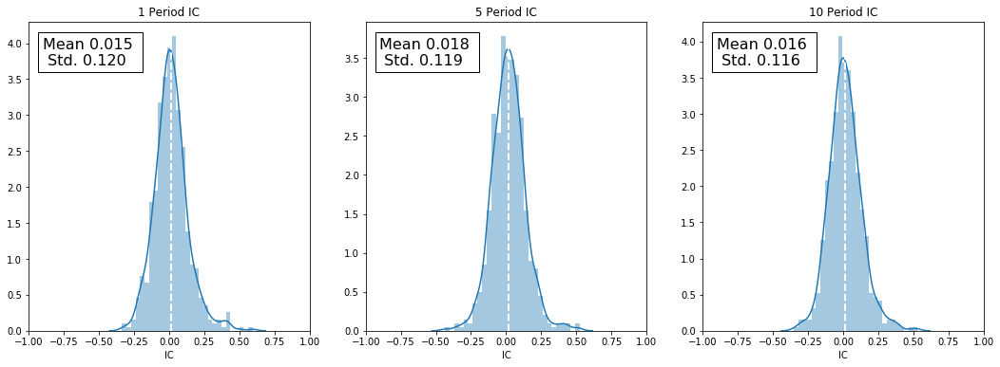


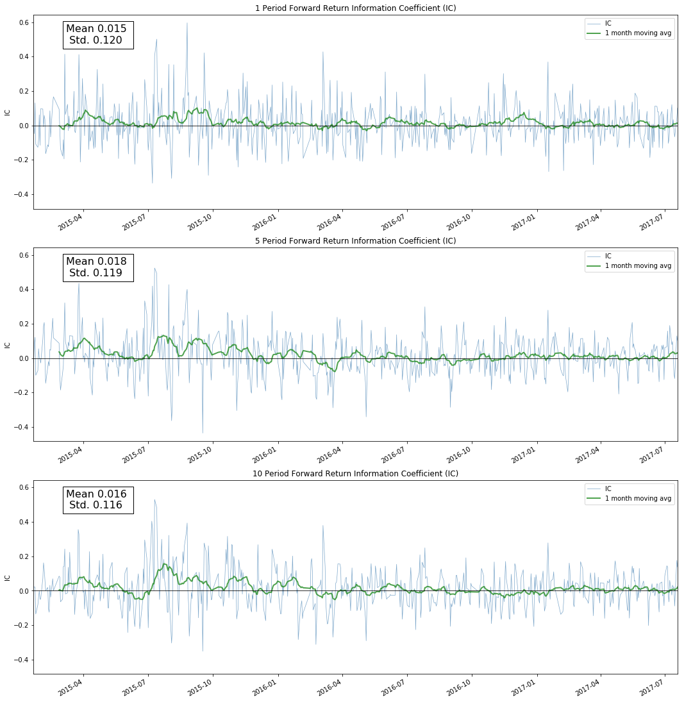


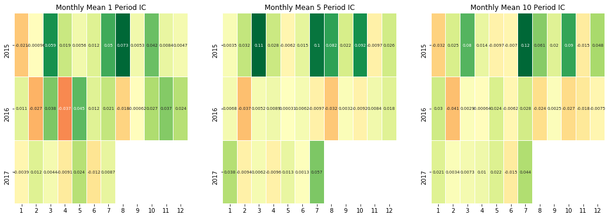


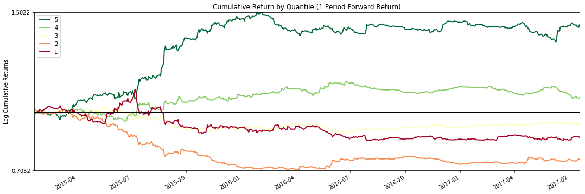


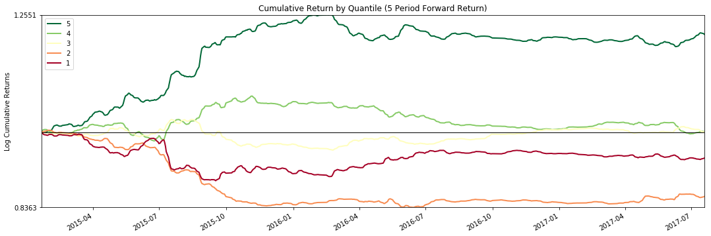


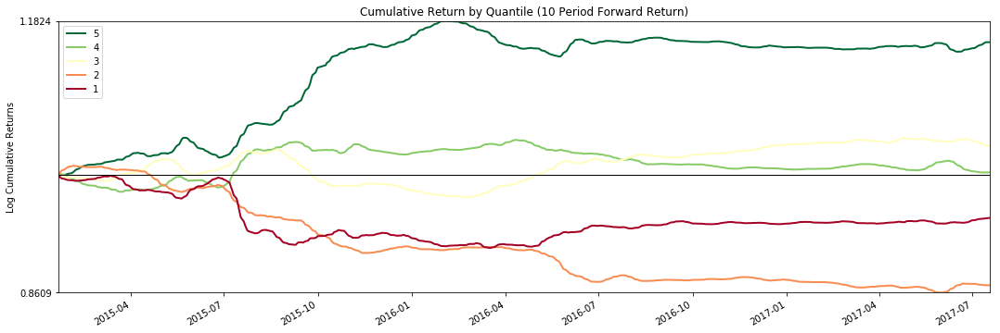


```python
from fxdayu_alphaman.factor.admin import Admin

factor_admin = Admin()
original_perf = factor_admin.calculate_performance('Volume001',
                                                   factor,
                                                   start,
                                                   end,
                                                   periods=(1,5,10),
                                                   quantiles=5,
                                                   price=prices)
original_perf.mean_ic
```


<div>
<style>
    .dataframe thead tr:only-child th {
        text-align: right;
    }

    .dataframe thead th {
        text-align: left;
    }

    .dataframe tbody tr th {
        vertical-align: top;
    }
</style>
<table border="1" class="dataframe">
  <thead>
    <tr style="text-align: right;">
      <th></th>
      <th>0</th>
    </tr>
  </thead>
  <tbody>
    <tr>
      <th>1</th>
      <td>0.014715</td>
    </tr>
    <tr>
      <th>5</th>
      <td>0.018427</td>
    </tr>
    <tr>
      <th>10</th>
      <td>0.015767</td>
    </tr>
  </tbody>
</table>
</div>


## Step_5： 优化因子的参数，并读取最优参数的因子值与绩效
* 用enumerate_parameter枚举优化参数，返回因子值与参数值的列表
* 用show_factors_performance计算绩效，返回每个参数绩效的对象
* 用rank_performance对绩效排序，输出第一个的绩效与参数
* 用instantiate_factor_and_get_factor_value实例化因子并返回最优因子值
* 用calculate_performance计算获取最优绩效


```python
# 参数优化

para_range_dict = {"c":range(3,11,1)}
# 1.枚举参数空间
factor_value_list,para_dict_list = factor_admin.enumerate_parameter('Factor_Volume001',
                                                                    para_range_dict,
                                                                    codes,start,
                                                                    end, 
                                                                    Factor=volume001,data=PN)
factor_name_list = []
for para_dict in para_dict_list:
    factor_name_list.append("Factor_Volume001+" + str(para_dict))
    
factors_dict = dict(zip(factor_name_list,factor_value_list))

# 2.获得不同参数下计算得出的因子值的表现
performance_list = factor_admin.show_factors_performance(factors_dict,
                                                         start,
                                                         end,
                                                         periods=(1,5,10),
                                                         quantiles=5,
                                                         price=prices)

# print("#####################################################################################")
# 按绩效指标对结果排序（寻优） 本例按10天持有期的mean_IC降序排列了所有结果。
performance_list = factor_admin.rank_performance(performance_list,
                                                 target_period=10,
                                                 ascending=False)

# 输出最优因子的ic和名称
print (performance_list[0].mean_ic)
print (performance_list[0].factor_name)
```

               0
    1   0.015963
    5   0.019791
    10  0.026054
    Factor_Volume001+{'c': 6}


```python
factor_opt = factor_admin.instantiate_factor_and_get_factor_value('Factor_Volume001',
                                                                  start=start, 
                                                                  end=end, 
                                                                  pool=codes, 
                                                                  data=PN, 
                                                                  Factor=volume001,
                                                                  para_dict={'c':6})
```


```python
perf = factor_admin.calculate_performance('Volume001',
                                          factor_opt,
                                          start,
                                          end,
                                          periods=(1,5,10),
                                          quantiles=5, 
                                          price=prices)
perf.mean_ic
```


<div>
<style>
    .dataframe thead tr:only-child th {
        text-align: right;
    }

    .dataframe thead th {
        text-align: left;
    }

    .dataframe tbody tr th {
        vertical-align: top;
    }
</style>
<table border="1" class="dataframe">
  <thead>
    <tr style="text-align: right;">
      <th></th>
      <th>0</th>
    </tr>
  </thead>
  <tbody>
    <tr>
      <th>1</th>
      <td>0.015963</td>
    </tr>
    <tr>
      <th>5</th>
      <td>0.019791</td>
    </tr>
    <tr>
      <th>10</th>
      <td>0.026054</td>
    </tr>
  </tbody>
</table>
</div>


## Step_6： 最优绩效结果可视化与保存Excel


```python
plot_performance(factor_opt,prices)
```

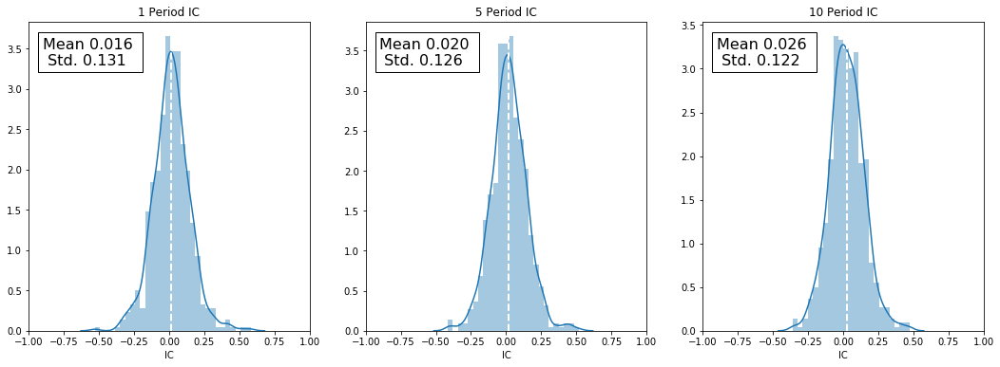


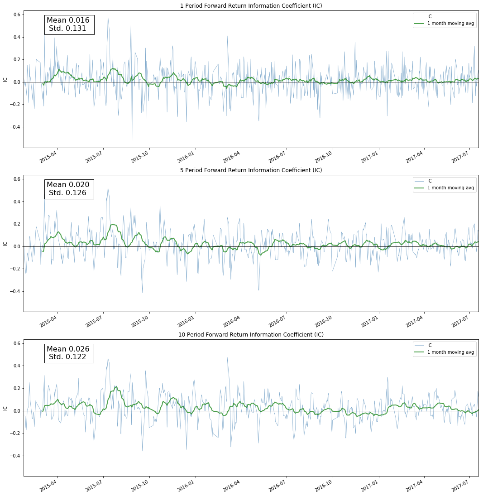


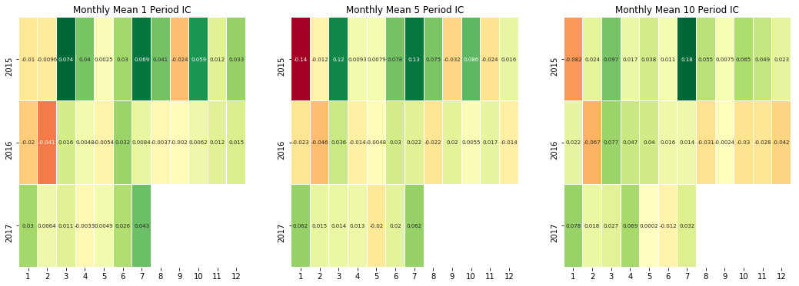


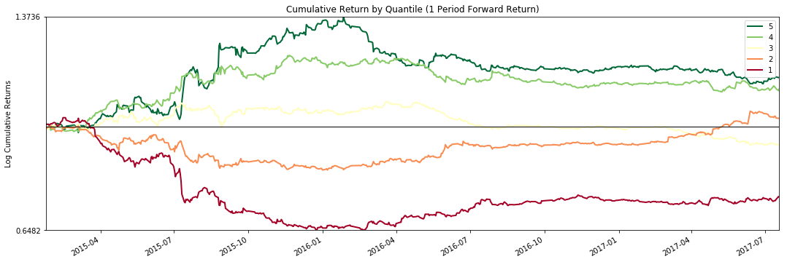


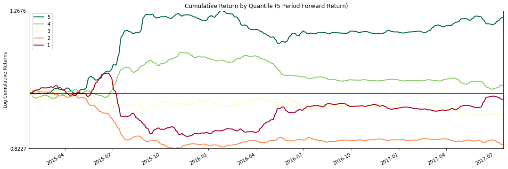


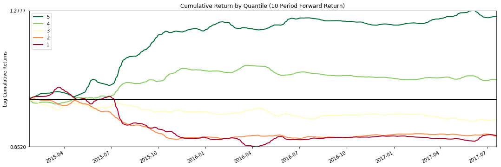


```python
import alphalens
import numpy as np

quantile = alphalens.utils.quantize_factor(factor_opt,quantiles=5)
factor_sheet = quantile[quantile==5].unstack().replace(np.nan, 0).replace(5, 1)
factor_sheet.to_excel('factor_opt.xlsx')
```
