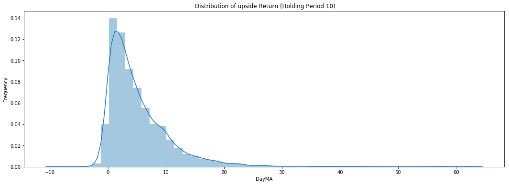
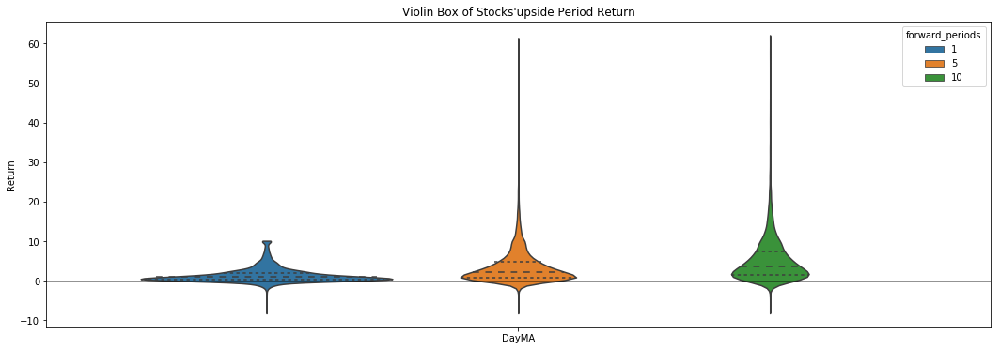
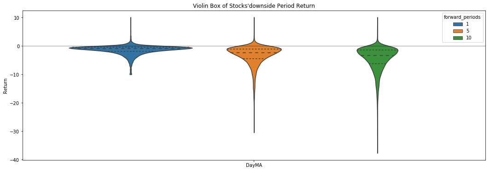
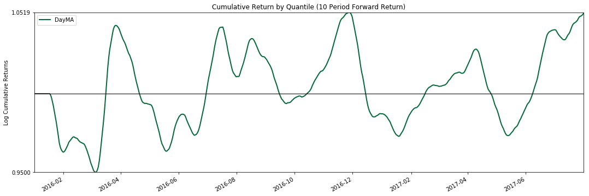
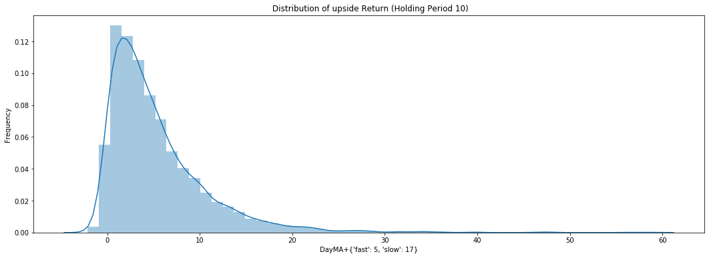
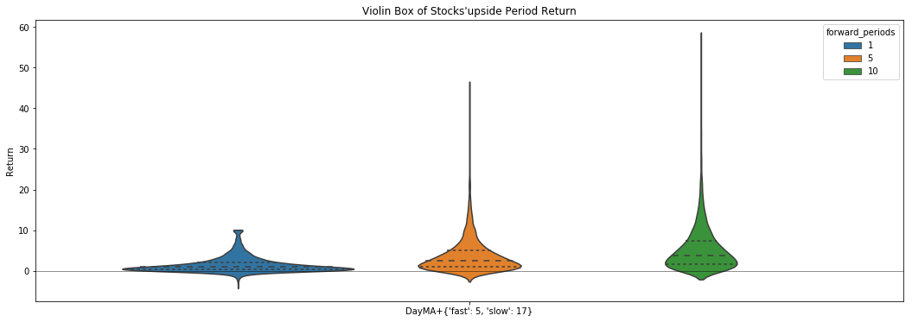
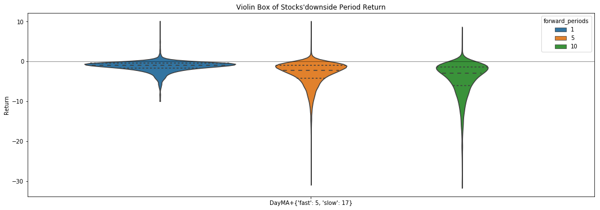
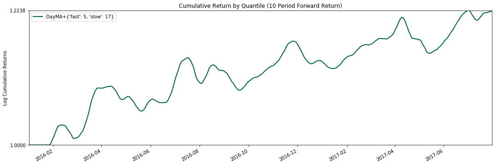

# 如何设计信号选股方案并进行优化评估?

## 步骤

Step_1： 设计编写选股器算法的类，逐行计算合成DataFrame，返回MultiIndex

Step_2： 股票池与数据读取

Step_3： 初始化选股器的类，并获取选股信号

Step_4： 评估选股信号效果

Step_5： 优化选股算法的参数

Step_6： 测算不同参数组下选股信号的绩效

Step_7： 最优绩效结果可视化与保存Excel

## Step_1： 设计编写选股器算法的类，逐行计算合成DataFrame，返回MultiIndex
* 选股器的类：父类， 子类， 继承， 实例化
* 设置参数与编写MA交叉的选股器信号
* 数据格式与合成
* 返回MultiIndex


```python
# encoding:utf-8
import pandas as pd
from talib.abstract import MA
from fxdayu_alphaman.selector.selector import Selector

class DayMA(Selector):

    # 在此处设置选股器相关参数
    fast = 5
    slow = 10

    def calculate_MA_signal(self, data):
        candle_data = data[1].dropna()
        if len(candle_data) == 0:
            return
        fast = MA(candle_data, timeperiod=self.fast)
        slow = MA(candle_data, timeperiod=self.slow)
        f_over_s = fast - slow >0
        f_under_s = fast - slow <=0
        cross_over = (f_under_s.shift(1)) * f_over_s
        cross_under = - (f_over_s.shift(1))*f_under_s
        choice = pd.DataFrame(cross_over + cross_under)
        choice.columns = [data[0],]
        return choice

    def execute(self, pool, start, end, data=None, data_config=None):
        selector_result = map(self.calculate_MA_signal, data.iteritems())
        selector_result = pd.concat(selector_result, axis=1).stack()
        selector_result.index.names = ["date","asset"]
        return selector_result.loc[start:end]
```

## Step_2： 股票池与数据读取
* 选取沪深300的股票代号，需要元组类型
* 获取因子的Panel数据与价格的DataFrame数据


```python
from datetime import datetime
from fxdayu_data import DataAPI

# 测试参数设置
start = datetime(2016, 1, 1)
end = datetime(2017, 8, 1, 15)
periods = (1, 5, 10)

# 获取数据
codes = DataAPI.info.codes('hs300')
PN = DataAPI.candle(codes, 'D', start=start, end=end, adjust="after")
```

## Step_3： 初始化选股器的类，并获取选股信号
* 初始化选股器
* 初始化管理器
* 用instantiate_selector_and_get_selector_result返回选股器的数值（1,0,-1）
* 获取沪深300基准数据，用calculate_performance计算选股器收益绩效


```python
from fxdayu_alphaman.selector.admin import Admin

selector = DayMA()
s_admin = Admin()
result = s_admin.instantiate_selector_and_get_selector_result("DayMA", codes, start, end, Selector=selector, data=PN)
result.head()
```


    date                 asset      
    2016-01-05 15:00:00  000001.XSHE    0
                         000008.XSHE    0
                         000009.XSHE    0
                         000027.XSHE    0
                         000039.XSHE    0
    dtype: object


```python
from fxdayu_alphaman.selector.utility import read_benchmark
from fxdayu_alphaman.selector.selector_analysis import *

hs300 = read_benchmark(start, end)
hs300_return = get_stocklist_mean_return(hs300["index"],"hs300",start,end,hs300["close"],periods=periods)
print (hs300_return.head())
```

                                               1         5         10
    factor_quantile date                                             
    hs300           2016-01-01 15:00:00  0.000000  0.000000  0.000000
                    2016-01-02 15:00:00  0.000000  0.000000  0.000000
                    2016-01-03 15:00:00  0.000000  0.000000  0.000000
                    2016-01-04 15:00:00  0.002412 -0.080094 -0.097879
                    2016-01-05 15:00:00  0.017544 -0.075621 -0.073491


```python
performance = s_admin.calculate_performance("DayMA",
                                           result[result>0], #结果大于0的（选出的）
                                           start,
                                           end,
                                           periods=periods,
                                           benchmark_return=hs300_return)
```

## Step_4： 评估选股信号效果
* 将performance的分布与收益曲线可视化 
* 计算潜在上涨最大收益与潜在下跌最大收益的Quantile四分位,以此设计止盈止损


```python
import alphalens

def plot_performance(performance):
    # 1.收益概率密度分布图
    plot_distribution_of_returns(performance["upside_return"],period=10,return_type="upside")
    # 2.收益概率密度分布图-提琴盒图
    plot_stock_returns_violin(performance["upside_return"],return_type="upside")
    plot_stock_returns_violin(performance["downside_return"],return_type="downside")
    # 3.累积收益曲线
    alphalens.plotting.plot_cumulative_returns_by_quantile(performance["mean_return"],period=10)
    plt.show()

plot_performance(performance)
```














```python
performance["upside_return"][10].quantile(0.75)
```


    0.07277158864561174


```python
performance["downside_return"][10].quantile(0.25)
```


    -0.06368988454774831


## Step_5： 优化选股算法的参数
* 生成参数范围的字典
* 用enumerate_parameter来返回结果值与参数值的列表
* 将返回做成策略名称与策略结果的列表


```python
#优化选股器参数
para_range_dict = {"fast":range(2,7,1),"slow":range(10,20,1)}
results_list, para_dict_list = s_admin.enumerate_parameter("DayMA",
                                                          para_range_dict,
                                                          codes,
                                                          start,
                                                          end,
                                                          Selector=selector,
                                                          data=PN,
                                                          parallel=False)
```


```python
# 生成策略名称与策略结果的列表
strategy_name_list = []
strategy_result_list = []
for i in range(len(results_list)):
    strategy_name = "DayMA+" + str(para_dict_list[i])
    strategy_name_list.append(strategy_name)
    strategy_result = results_list[i][results_list[i]>0]
    strategy_result_list.append(strategy_result)
# 转成字典
strategies_dict = dict(zip(strategy_name_list,strategy_result_list))
```

## Step_6： 测算不同参数组下选股信号的绩效
* 用show_strategies_performance计算每组参数下策略的绩效
* 用rank_performance输入作为排序的绩效指标，返回参数绩效顺序的对象


```python
performance_list = s_admin.show_strategies_performance(strategies_dict,
                                                       start,
                                                       end,
                                                       periods=periods,
                                                       benchmark_return=hs300_return,
                                                       parallel=False)
```


```python
# 按夏普率对选股信号-10天持仓目标寻优
performance_rank = s_admin.rank_performance(performance_list,
                                            target_period=10,
                                            target_indicator="Sharpe ratio",
                                            ascending=False)

print (performance_rank[0].strategy_name)
print (performance_rank[0].key_performance_indicator)
```

    DayMA+{'fast': 5, 'slow': 17}
    {'period_1': Annual return           0.213809
    Cumulative returns      0.559594
    Annual volatility       0.196486
    Sharpe ratio            1.084199
    Calmar ratio            2.136484
    Stability               0.840634
    Max drawdown           -0.100075
    Omega ratio             1.316553
    Sortino ratio           1.758733
    Skew                    0.574238
    Kurtosis               17.237858
    Tail ratio              1.429563
    Daily value at risk    -0.023910
    Alpha                   0.183615
    Beta                    0.702764
    dtype: float64, 'period_5': Annual return           0.778220
    Cumulative returns      2.744378
    Annual volatility       0.425004
    Sharpe ratio            1.563172
    Calmar ratio            2.163461
    Stability               0.851017
    Max drawdown           -0.359711
    Omega ratio             1.453197
    Sortino ratio           2.710378
    Skew                    1.402135
    Kurtosis               11.286613
    Tail ratio              1.384488
    Daily value at risk    -0.050909
    Alpha                   0.483488
    Beta                    0.783914
    dtype: float64, 'period_10': Annual return          1.252662
    Cumulative returns     5.441124
    Annual volatility      0.476812
    Sharpe ratio           1.941938
    Calmar ratio           2.704256
    Stability              0.825575
    Max drawdown          -0.463219
    Omega ratio            1.525303
    Sortino ratio          3.171053
    Skew                   0.375062
    Kurtosis               3.475793
    Tail ratio             1.311518
    Daily value at risk   -0.056398
    Alpha                  0.531952
    Beta                   0.657460
    dtype: float64}


## Step_7： 最优绩效结果可视化与保存Excel
* 获取最优的Quantile四分位


```python
plot_performance(performance_rank[0])
```














```python
performance_rank[0]["upside_return"][10].quantile(0.75)
```


    0.07308712427150793


```python
performance_rank[0]["downside_return"][10].quantile(0.25)
```


    -0.06067362007195723


```python
import numpy as np

selector_sheet = s_admin.instantiate_selector_and_get_selector_result("DayMA", 
                                                                      codes, 
                                                                      start, 
                                                                      end, 
                                                                      Selector=selector, 
                                                                      data=PN, 
                                                                      para_dict={"slow":17, "fast":5})
selector_sheet = selector_sheet.unstack().replace(np.nan,0)
selector_sheet.to_excel('selector_opt.xlsx')
```
