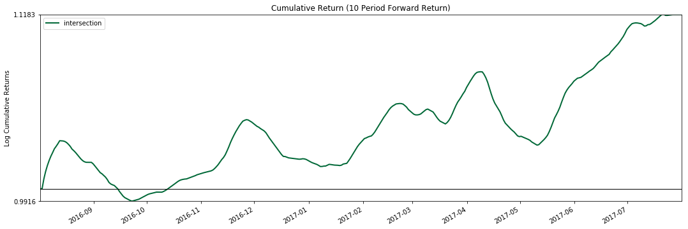

# 如何对不同选股方案进行组合(股票多策略)？

## 步骤

组合方案以交集为例

Step_1： 读取选股结果的Excel

Step_2： 初始化admin，并计算交集的结果

Step_3： 计算交集的绩效

Step_4： 可视化收益绩效

## 读取选股结果的Excel
* 获取PB与PS选股的结果
* 获取MA选股的结果
* 将选股结果处理成MultiIndex格式


```python
import pandas as pd

fundamental = pd.read_excel('fundamental_opt.xlsx')
selector_opt = pd.read_excel('selector_opt.xlsx')

fundamental= fundamental.set_index("date").stack()
selector_opt= selector_opt.set_index("date").stack()

print (fundamental.head())
print (selector_opt.head())
```

    date                            
    2016-04-18 15:00:00  000001.XSHE    0
                         000002.XSHE    0
                         000008.XSHE    0
                         000063.XSHE    0
                         000069.XSHE    0
    dtype: int64
    date                            
    2016-01-05 15:00:00  000001.XSHE    0
                         000002.XSHE    0
                         000008.XSHE    0
                         000009.XSHE    0
                         000027.XSHE    0
    dtype: int64


## Step_2： 初始化admin，并计算交集的结果
* 输入两个优化选股结果表格
* 用Intersection_Strategy返回交集的结果


```python
from fxdayu_alphaman.selector.admin import Admin

admin = Admin()
selectors_result_dict = {'fundamental':fundamental, 'selector_opt':selector_opt}

Intersection = admin.Intersection_Strategy(selectors_result_dict)
```

## Step_3： 计算交集的绩效
* 用calculate_performance计算策略交集方案的绩效


```python
from datetime import datetime

intersection_perf = admin.calculate_performance('intersection', 
                                                Intersection.strategy_result, 
                                                start=datetime(2016,8,1), 
                                                end=datetime(2017,8,1), 
                                                periods=(5,10))

intersection_perf.key_performance_indicator
```

    {'period_10': Annual return          0.812742
     Cumulative returns     1.366884
     Annual volatility      0.471855
     Sharpe ratio           1.494164
     Calmar ratio           1.922407
     Stability              0.663080
     Max drawdown          -0.422773
     Omega ratio            1.460863
     Sortino ratio          2.375447
     Skew                   0.781294
     Kurtosis               8.222360
     Tail ratio             1.037659
     Daily value at risk   -0.056650
     dtype: float64, 'period_5': Annual return           0.971996
     Cumulative returns      1.673903
     Annual volatility       0.388870
     Sharpe ratio            1.934711
     Calmar ratio            3.224484
     Stability               0.841191
     Max drawdown           -0.301442
     Omega ratio             1.763322
     Sortino ratio           3.659188
     Skew                    2.728743
     Kurtosis               25.203336
     Tail ratio              1.297583
     Daily value at risk    -0.046008
     dtype: float64}


```python
from fxdayu_alphaman.selector.selector_analysis import *

plot_cumulative_returns(intersection_perf.mean_return, period=10)
plt.show()
```





```python
Intersection.strategy_result.unstack().replace(np.nan,0).replace(2,1).to_excel('intersection.xlsx')
```
